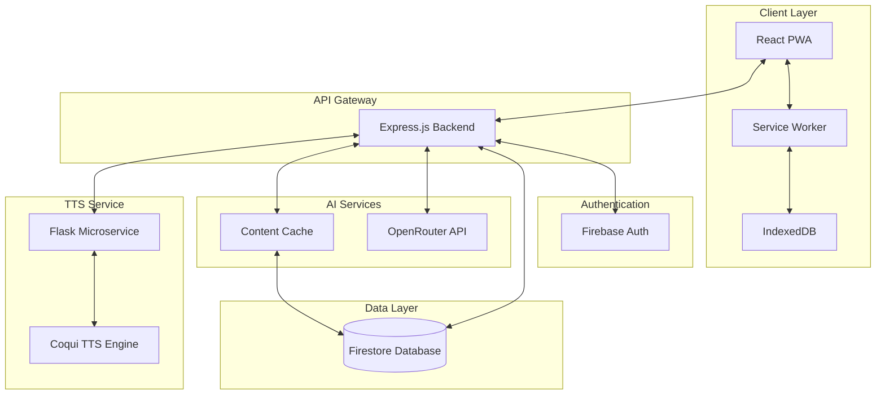
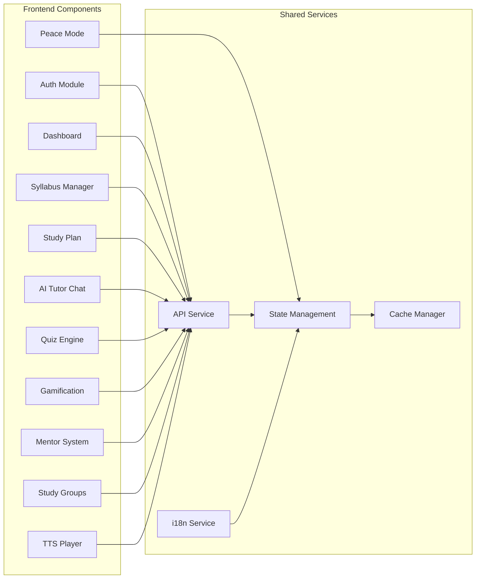
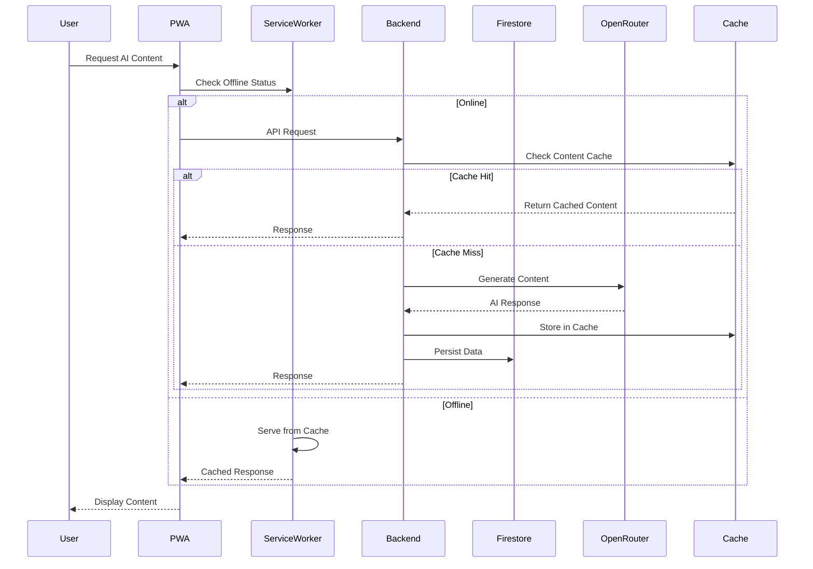
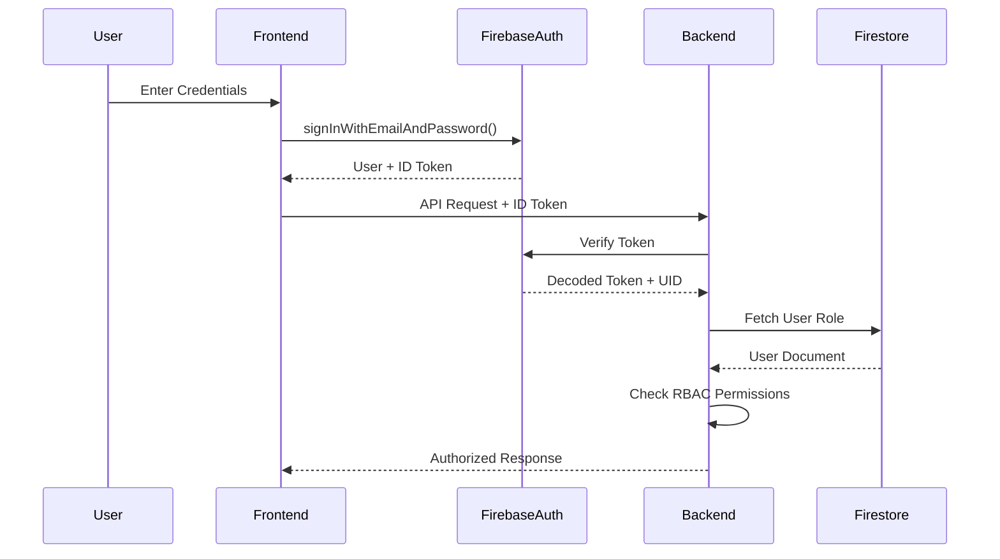
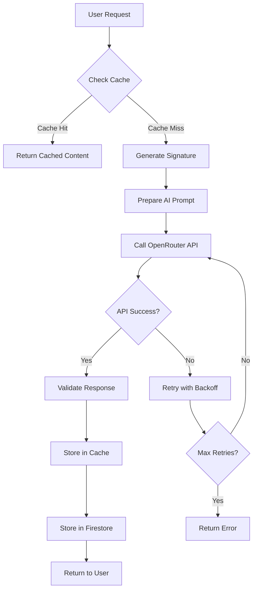
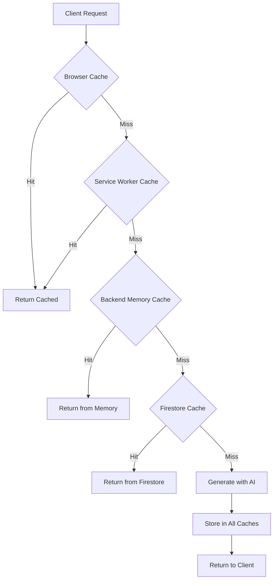
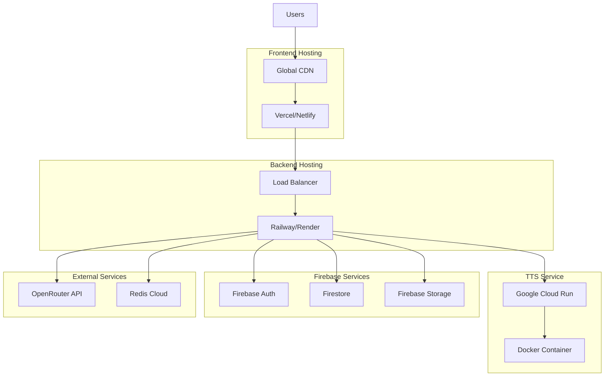

# Design Document: AI-Powered EduTech Platform

## Overview

The AI-powered EduTech platform is a comprehensive web-based Progressive Web Application (PWA) designed to revolutionize competitive exam preparation in India. The system leverages artificial intelligence to provide personalized learning experiences, intelligent tutoring, and collaborative study environments.

### Core Architecture Principles

1. **Offline-First Design**: PWA architecture with service workers and local caching
2. **Serverless Backend**: Node.js/Express backend with Firebase services for scalability
3. **AI-Powered Intelligence**: OpenRouter API integration for personalized content generation
4. **Real-Time Collaboration**: Firestore real-time listeners for chat and notifications
5. **Microservices for Specialized Tasks**: Separate Python Flask service for TTS generation
6. **Cost-Effective Caching**: Signature-based content caching to minimize AI API costs
7. **Multilingual Support**: i18n architecture supporting 8+ Indian languages

### Technology Stack Summary

**Frontend**:
- React 18+ with Vite for fast development and optimized builds
- React Router v6 for client-side routing
- Framer Motion for smooth animations and transitions
- Three.js for 3D gamification elements
- Workbox for PWA service worker management
- i18next for internationalization

**Backend**:
- Node.js with Express.js framework
- Firebase Admin SDK for authentication and Firestore access
- Multer for file upload handling
- pdf-parse for PDF syllabus extraction
- Axios for external API calls

**Database**:
- Firebase Firestore (NoSQL document database)
- Firestore Security Rules for access control
- Composite indexes for optimized queries

**AI Services**:
- OpenRouter API (GPT-3.5-turbo, GPT-4)
- Custom prompt engineering for educational content

**TTS Service**:
- Python Flask microservice
- Coqui TTS engine for multilingual audio generation
- MP3 encoding for audio output

**Deployment**:
- Frontend: Vercel, Netlify, or Firebase Hosting
- Backend: Railway, Render, or Google Cloud Run
- TTS Service: Separate container deployment
- Environment variables for configuration management

## Architecture

### High-Level System Architecture



### Component Architecture



### Request Flow Architecture



## Components and Interfaces

### Frontend Component Structure

```
src/
├── components/
│   ├── auth/
│   │   ├── Login.jsx
│   │   ├── Register.jsx
│   │   └── RoleSelector.jsx
│   ├── dashboard/
│   │   ├── StudentDashboard.jsx
│   │   ├── MentorDashboard.jsx
│   │   └── ProgressChart.jsx
│   ├── syllabus/
│   │   ├── SyllabusUpload.jsx
│   │   ├── SyllabusSelector.jsx
│   │   └── TopicTree.jsx
│   ├── study-plan/
│   │   ├── PlanGenerator.jsx
│   │   ├── Calendar.jsx
│   │   └── TopicCard.jsx
│   ├── ai-tutor/
│   │   ├── ChatInterface.jsx
│   │   ├── MessageBubble.jsx
│   │   └── ContextPanel.jsx
│   ├── quiz/
│   │   ├── QuizGenerator.jsx
│   │   ├── QuestionCard.jsx
│   │   ├── ResultsView.jsx
│   │   └── MasteryTracker.jsx
│   ├── games/
│   │   ├── ZombieGame.jsx
│   │   ├── MemoryGame.jsx
│   │   └── WhackAMole.jsx
│   ├── mentor/
│   │   ├── MentorBrowser.jsx
│   │   ├── ConnectionRequest.jsx
│   │   ├── DoubtTicket.jsx
│   │   └── MeetingScheduler.jsx
│   ├── study-groups/
│   │   ├── GroupList.jsx
│   │   ├── GroupChat.jsx
│   │   └── GroupCreator.jsx
│   ├── tts/
│   │   ├── TTSPlayer.jsx
│   │   └── PodcastGenerator.jsx
│   ├── peace-mode/
│   │   ├── PeaceMode.jsx
│   │   ├── BreathingExercise.jsx
│   │   └── MotivationalQuotes.jsx
│   └── shared/
│       ├── Navbar.jsx
│       ├── Sidebar.jsx
│       ├── LanguageSelector.jsx
│       └── OfflineIndicator.jsx
├── services/
│   ├── api.js
│   ├── auth.js
│   ├── cache.js
│   ├── firestore.js
│   └── i18n.js
├── hooks/
│   ├── useAuth.js
│   ├── useFirestore.js
│   ├── useOffline.js
│   └── useLanguage.js
├── utils/
│   ├── validators.js
│   ├── formatters.js
│   └── constants.js
└── sw.js (Service Worker)
```

### Backend API Structure

```
backend/
├── routes/
│   ├── auth.js
│   ├── syllabus.js
│   ├── studyPlan.js
│   ├── aiTutor.js
│   ├── quiz.js
│   ├── notes.js
│   ├── mentor.js
│   ├── studyGroups.js
│   ├── tts.js
│   └── analytics.js
├── middleware/
│   ├── authenticate.js
│   ├── authorize.js
│   ├── validate.js
│   ├── rateLimit.js
│   └── errorHandler.js
├── services/
│   ├── aiService.js
│   ├── cacheService.js
│   ├── firestoreService.js
│   ├── pdfParser.js
│   └── ttsClient.js
├── utils/
│   ├── prompts.js
│   ├── validators.js
│   └── helpers.js
└── server.js
```

### API Interface Definitions

#### Authentication Endpoints

```typescript
POST /api/auth/register
Request: {
  email: string;
  password: string;
  role: "student" | "mentor";
  name: string;
  preferredLanguage: string;
}
Response: {
  success: boolean;
  user: {
    uid: string;
    email: string;
    role: string;
    name: string;
  };
  token: string;
}

POST /api/auth/login
Request: {
  email: string;
  password: string;
}
Response: {
  success: boolean;
  user: UserObject;
  token: string;
}

POST /api/auth/logout
Headers: { Authorization: "Bearer <token>" }
Response: { success: boolean; }
```

#### Syllabus Management Endpoints

```typescript
POST /api/syllabus/upload
Headers: { Authorization: "Bearer <token>" }
Content-Type: multipart/form-data
Request: {
  file: File; // PDF file
  examName: string;
}
Response: {
  success: boolean;
  syllabusId: string;
  topics: Array<{
    name: string;
    subtopics: string[];
  }>;
}

GET /api/syllabus/presets
Response: {
  syllabi: Array<{
    id: string;
    examName: string;
    topics: TopicTree;
  }>;
}

POST /api/syllabus/manual
Headers: { Authorization: "Bearer <token>" }
Request: {
  examName: string;
  topics: Array<{
    name: string;
    subtopics: string[];
  }>;
}
Response: {
  success: boolean;
  syllabusId: string;
}
```

#### Study Plan Endpoints

```typescript
POST /api/study-plan/generate
Headers: { Authorization: "Bearer <token>" }
Request: {
  syllabusId: string;
  examDate: string; // ISO date
  dailyStudyHours: number;
  currentMasteryScores?: Record<string, number>;
}
Response: {
  success: boolean;
  studyPlanId: string;
  plan: {
    dailySchedule: Array<{
      date: string;
      topics: string[];
      objectives: string[];
      estimatedTime: number;
    }>;
    totalDays: number;
    coveragePercentage: number;
  };
}

GET /api/study-plan/:planId
Headers: { Authorization: "Bearer <token>" }
Response: {
  success: boolean;
  plan: StudyPlanObject;
}

PATCH /api/study-plan/:planId/progress
Headers: { Authorization: "Bearer <token>" }
Request: {
  date: string;
  topicId: string;
  completed: boolean;
}
Response: {
  success: boolean;
  updatedPlan: StudyPlanObject;
}
```

#### AI Tutor Endpoints

```typescript
POST /api/ai-tutor/chat
Headers: { Authorization: "Bearer <token>" }
Request: {
  message: string;
  conversationId?: string;
  currentTopic?: string;
  language: string;
}
Response: {
  success: boolean;
  conversationId: string;
  response: string;
  context: {
    topicReferences: string[];
    suggestedResources: string[];
  };
}

GET /api/ai-tutor/conversations
Headers: { Authorization: "Bearer <token>" }
Response: {
  conversations: Array<{
    id: string;
    lastMessage: string;
    timestamp: string;
  }>;
}
```

#### Quiz Endpoints

```typescript
POST /api/quiz/generate
Headers: { Authorization: "Bearer <token>" }
Request: {
  topicId: string;
  difficulty: "easy" | "medium" | "hard";
  questionCount: number; // 5-20
  language: string;
}
Response: {
  success: boolean;
  quizId: string;
  questions: Array<{
    id: string;
    question: string;
    options: string[]; // 4 options
    correctAnswer: number; // index 0-3
    explanation: string;
  }>;
}

POST /api/quiz/submit
Headers: { Authorization: "Bearer <token>" }
Request: {
  quizId: string;
  answers: Record<string, number>; // questionId -> selectedOption
  timeTaken: number; // seconds
}
Response: {
  success: boolean;
  score: number;
  totalQuestions: number;
  correctAnswers: number;
  masteryScoreUpdate: {
    topicId: string;
    oldScore: number;
    newScore: number;
  };
  detailedResults: Array<{
    questionId: string;
    correct: boolean;
    explanation: string;
  }>;
}

GET /api/quiz/history
Headers: { Authorization: "Bearer <token>" }
Query: { topicId?: string; limit?: number; }
Response: {
  quizzes: Array<QuizResultObject>;
}
```

#### Notes Endpoints

```typescript
POST /api/notes/generate
Headers: { Authorization: "Bearer <token>" }
Request: {
  topicId: string;
  language: string;
  detailLevel: "brief" | "detailed" | "comprehensive";
}
Response: {
  success: boolean;
  noteId: string;
  content: {
    title: string;
    sections: Array<{
      heading: string;
      content: string;
      keyPoints: string[];
    }>;
  };
}

GET /api/notes/:noteId
Headers: { Authorization: "Bearer <token>" }
Response: {
  success: boolean;
  note: NoteObject;
}
```

#### Mentor System Endpoints

```typescript
GET /api/mentors/browse
Headers: { Authorization: "Bearer <token>" }
Query: { subject?: string; language?: string; }
Response: {
  mentors: Array<{
    id: string;
    name: string;
    subjects: string[];
    languages: string[];
    rating: number;
    studentsCount: number;
  }>;
}

POST /api/mentors/connect
Headers: { Authorization: "Bearer <token>" }
Request: {
  mentorId: string;
  message: string;
}
Response: {
  success: boolean;
  requestId: string;
}

POST /api/mentors/respond
Headers: { Authorization: "Bearer <token>" }
Request: {
  requestId: string;
  accept: boolean;
}
Response: {
  success: boolean;
  connectionId?: string;
}

POST /api/doubts/create
Headers: { Authorization: "Bearer <token>" }
Request: {
  mentorId: string;
  topicId: string;
  question: string;
  attachments?: string[]; // URLs
}
Response: {
  success: boolean;
  ticketId: string;
}

POST /api/doubts/:ticketId/respond
Headers: { Authorization: "Bearer <token>" }
Request: {
  response: string;
  attachments?: string[];
}
Response: {
  success: boolean;
}

POST /api/meetings/schedule
Headers: { Authorization: "Bearer <token>" }
Request: {
  mentorId: string;
  proposedTimes: string[]; // ISO timestamps
  topic: string;
}
Response: {
  success: boolean;
  meetingRequestId: string;
}
```

#### Study Groups Endpoints

```typescript
POST /api/study-groups/create
Headers: { Authorization: "Bearer <token>" }
Request: {
  name: string;
  description: string;
  examType: string;
  maxMembers: number; // max 50
}
Response: {
  success: boolean;
  groupId: string;
  inviteCode: string;
}

POST /api/study-groups/join
Headers: { Authorization: "Bearer <token>" }
Request: {
  inviteCode: string;
}
Response: {
  success: boolean;
  groupId: string;
}

GET /api/study-groups/:groupId/messages
Headers: { Authorization: "Bearer <token>" }
Query: { limit?: number; before?: string; }
Response: {
  messages: Array<{
    id: string;
    senderId: string;
    senderName: string;
    content: string;
    timestamp: string;
    attachments?: string[];
  }>;
}

POST /api/study-groups/:groupId/messages
Headers: { Authorization: "Bearer <token>" }
Request: {
  content: string;
  attachments?: string[];
}
Response: {
  success: boolean;
  messageId: string;
}

// Real-time updates via Firestore listeners on client
```

#### TTS Endpoints

```typescript
POST /api/tts/generate
Headers: { Authorization: "Bearer <token>" }
Request: {
  text: string;
  language: string;
  voice?: string;
  speed?: number; // 0.5 - 2.0
}
Response: {
  success: boolean;
  audioUrl: string;
  duration: number; // seconds
}

POST /api/tts/podcast
Headers: { Authorization: "Bearer <token>" }
Request: {
  noteId: string;
  language: string;
  includeIntro: boolean;
}
Response: {
  success: boolean;
  podcastUrl: string;
  duration: number;
}
```

#### Analytics Endpoints

```typescript
GET /api/analytics/dashboard
Headers: { Authorization: "Bearer <token>" }
Response: {
  overallProgress: number; // percentage
  masteryScores: Record<string, number>;
  studyStreak: number; // days
  totalStudyTime: number; // minutes
  quizPerformance: {
    averageScore: number;
    totalQuizzes: number;
    improvementTrend: number; // percentage
  };
  weakTopics: Array<{
    topicId: string;
    topicName: string;
    masteryScore: number;
  }>;
}

GET /api/analytics/progress-history
Headers: { Authorization: "Bearer <token>" }
Query: { days?: number; }
Response: {
  dailyProgress: Array<{
    date: string;
    studyTime: number;
    quizzesCompleted: number;
    topicsCompleted: number;
  }>;
}
```

## Data Models

### Firestore Database Schema

#### users Collection

```typescript
{
  uid: string; // Firebase Auth UID
  email: string;
  name: string;
  role: "student" | "mentor" | "parent";
  preferredLanguage: string;
  createdAt: Timestamp;
  lastActive: Timestamp;
  profile: {
    avatar?: string;
    bio?: string;
    subjects?: string[]; // for mentors
    examTarget?: string; // for students
    targetDate?: Timestamp; // for students
  };
  settings: {
    notifications: boolean;
    dailyReminders: boolean;
    studyGoalMinutes: number;
  };
}
```

#### syllabi Collection

```typescript
{
  id: string;
  userId: string;
  examName: string;
  isPreset: boolean; // true for pre-stored syllabi
  topics: Array<{
    id: string;
    name: string;
    subtopics: Array<{
      id: string;
      name: string;
    }>;
  }>;
  createdAt: Timestamp;
  source: "upload" | "manual" | "preset";
  metadata?: {
    pdfUrl?: string;
    originalFilename?: string;
  };
}
```

#### studyPlans Collection

```typescript
{
  id: string;
  userId: string;
  syllabusId: string;
  examDate: Timestamp;
  dailyStudyHours: number;
  generatedAt: Timestamp;
  schedule: Array<{
    date: string; // YYYY-MM-DD
    topics: Array<{
      topicId: string;
      topicName: string;
      estimatedMinutes: number;
      completed: boolean;
      completedAt?: Timestamp;
    }>;
    objectives: string[];
  }>;
  progress: {
    completedDays: number;
    totalDays: number;
    completedTopics: number;
    totalTopics: number;
  };
}
```

#### quizzes Collection

```typescript
{
  id: string;
  userId: string;
  topicId: string;
  difficulty: "easy" | "medium" | "hard";
  language: string;
  generatedAt: Timestamp;
  questions: Array<{
    id: string;
    question: string;
    options: string[]; // 4 options
    correctAnswer: number; // index 0-3
    explanation: string;
  }>;
  cacheSignature: string; // for content caching
}
```

#### quizResults Collection

```typescript
{
  id: string;
  userId: string;
  quizId: string;
  topicId: string;
  score: number;
  totalQuestions: number;
  correctAnswers: number;
  timeTaken: number; // seconds
  completedAt: Timestamp;
  answers: Record<string, number>; // questionId -> selectedOption
  difficulty: string;
}
```

#### notes Collection

```typescript
{
  id: string;
  userId: string;
  topicId: string;
  language: string;
  detailLevel: string;
  generatedAt: Timestamp;
  content: {
    title: string;
    sections: Array<{
      heading: string;
      content: string;
      keyPoints: string[];
    }>;
  };
  cacheSignature: string;
}
```

#### masteryScores Collection

```typescript
{
  id: string; // composite: userId_topicId
  userId: string;
  topicId: string;
  topicName: string;
  score: number; // 0-100
  quizzesTaken: number;
  lastQuizScore: number;
  trend: "improving" | "stable" | "declining";
  updatedAt: Timestamp;
  history: Array<{
    date: Timestamp;
    score: number;
    quizId: string;
  }>;
}
```

#### mentorConnections Collection

```typescript
{
  id: string;
  studentId: string;
  mentorId: string;
  status: "pending" | "accepted" | "rejected";
  requestMessage: string;
  requestedAt: Timestamp;
  respondedAt?: Timestamp;
  connectionEstablishedAt?: Timestamp;
}
```

#### doubtTickets Collection

```typescript
{
  id: string;
  studentId: string;
  mentorId: string;
  topicId: string;
  status: "open" | "in_progress" | "resolved" | "closed";
  question: string;
  attachments: string[]; // URLs
  createdAt: Timestamp;
  responses: Array<{
    id: string;
    senderId: string;
    senderRole: "student" | "mentor";
    message: string;
    attachments: string[];
    timestamp: Timestamp;
  }>;
  resolvedAt?: Timestamp;
}
```

#### meetings Collection

```typescript
{
  id: string;
  studentId: string;
  mentorId: string;
  status: "proposed" | "confirmed" | "completed" | "cancelled";
  topic: string;
  proposedTimes: Timestamp[];
  confirmedTime?: Timestamp;
  meetingLink?: string;
  createdAt: Timestamp;
  reminders: {
    oneDayBefore: boolean;
    oneHourBefore: boolean;
  };
}
```

#### studyGroups Collection

```typescript
{
  id: string;
  name: string;
  description: string;
  examType: string;
  creatorId: string;
  inviteCode: string;
  maxMembers: number;
  currentMembers: number;
  members: Array<{
    userId: string;
    userName: string;
    joinedAt: Timestamp;
    role: "admin" | "member";
  }>;
  createdAt: Timestamp;
  settings: {
    allowFileSharing: boolean;
    moderationEnabled: boolean;
  };
}
```

#### chatMessages Collection

```typescript
{
  id: string;
  groupId: string;
  senderId: string;
  senderName: string;
  content: string;
  attachments: string[];
  timestamp: Timestamp;
  edited: boolean;
  editedAt?: Timestamp;
  reactions: Record<string, string[]>; // emoji -> userIds
}
```

#### contentCache Collection

```typescript
{
  id: string; // signature hash
  signature: string;
  contentType: "study_plan" | "quiz" | "notes" | "ai_tutor_response";
  content: any; // JSON content
  language: string;
  parameters: Record<string, any>; // input parameters
  createdAt: Timestamp;
  expiresAt: Timestamp; // 30 days from creation
  hitCount: number;
  lastAccessed: Timestamp;
}
```

#### analytics Collection

```typescript
{
  id: string; // userId_date
  userId: string;
  date: string; // YYYY-MM-DD
  studyTimeMinutes: number;
  quizzesCompleted: number;
  topicsCompleted: number;
  aiTutorMessages: number;
  gamesPlayed: number;
  peaceModeMinutes: number;
  activities: Array<{
    type: string;
    timestamp: Timestamp;
    metadata: Record<string, any>;
  }>;
}
```

### Firestore Indexes

```javascript
// Composite indexes for optimized queries
[
  {
    collection: "quizResults",
    fields: ["userId", "completedAt"],
    order: "desc"
  },
  {
    collection: "quizResults",
    fields: ["userId", "topicId", "completedAt"],
    order: "desc"
  },
  {
    collection: "chatMessages",
    fields: ["groupId", "timestamp"],
    order: "desc"
  },
  {
    collection: "doubtTickets",
    fields: ["studentId", "status", "createdAt"],
    order: "desc"
  },
  {
    collection: "doubtTickets",
    fields: ["mentorId", "status", "createdAt"],
    order: "desc"
  },
  {
    collection: "masteryScores",
    fields: ["userId", "score"],
    order: "asc"
  },
  {
    collection: "contentCache",
    fields: ["signature", "expiresAt"]
  }
]
```

## Authentication & Role-Based Access Control

### Firebase Authentication Flow



### RBAC Permission Matrix

```typescript
const PERMISSIONS = {
  student: [
    "syllabus:read",
    "syllabus:create",
    "studyPlan:read",
    "studyPlan:create",
    "studyPlan:update",
    "quiz:read",
    "quiz:create",
    "quiz:submit",
    "notes:read",
    "notes:create",
    "aiTutor:chat",
    "mentor:browse",
    "mentor:connect",
    "doubt:create",
    "doubt:read",
    "meeting:request",
    "studyGroup:join",
    "studyGroup:create",
    "studyGroup:chat",
    "tts:generate",
    "analytics:read_own"
  ],
  mentor: [
    "mentor:profile",
    "connection:accept",
    "connection:reject",
    "doubt:read",
    "doubt:respond",
    "meeting:accept",
    "meeting:schedule",
    "studyGroup:join",
    "studyGroup:create",
    "analytics:read_own"
  ],
  parent: [
    "analytics:read_child",
    "progress:monitor",
    "alerts:receive"
  ]
};
```

### Middleware Implementation

```javascript
// authenticate.js
async function authenticate(req, res, next) {
  const token = req.headers.authorization?.split('Bearer ')[1];
  
  if (!token) {
    return res.status(401).json({ error: 'No token provided' });
  }
  
  try {
    const decodedToken = await admin.auth().verifyIdToken(token);
    req.user = {
      uid: decodedToken.uid,
      email: decodedToken.email
    };
    
    // Fetch user role from Firestore
    const userDoc = await admin.firestore()
      .collection('users')
      .doc(req.user.uid)
      .get();
    
    if (!userDoc.exists) {
      return res.status(404).json({ error: 'User not found' });
    }
    
    req.user.role = userDoc.data().role;
    next();
  } catch (error) {
    return res.status(401).json({ error: 'Invalid token' });
  }
}

// authorize.js
function authorize(requiredPermission) {
  return (req, res, next) => {
    const userPermissions = PERMISSIONS[req.user.role] || [];
    
    if (!userPermissions.includes(requiredPermission)) {
      return res.status(403).json({ 
        error: 'Insufficient permissions',
        required: requiredPermission,
        role: req.user.role
      });
    }
    
    next();
  };
}

// Usage in routes
router.post('/quiz/generate', 
  authenticate, 
  authorize('quiz:create'), 
  generateQuiz
);
```

## AI Integration Flow

### OpenRouter API Integration



### AI Service Implementation

```javascript
// aiService.js
class AIService {
  constructor() {
    this.apiKey = process.env.OPENROUTER_API_KEY;
    this.baseUrl = 'https://openrouter.ai/api/v1';
    this.defaultModel = 'openai/gpt-3.5-turbo';
  }
  
  async generateStudyPlan(syllabus, examDate, dailyHours, masteryScores) {
    const signature = this.createSignature({
      type: 'study_plan',
      syllabusId: syllabus.id,
      examDate,
      dailyHours
    });
    
    // Check cache
    const cached = await cacheService.get(signature);
    if (cached) return cached;
    
    const prompt = this.buildStudyPlanPrompt(
      syllabus, 
      examDate, 
      dailyHours, 
      masteryScores
    );
    
    const response = await this.callOpenRouter(prompt, 'openai/gpt-4');
    const studyPlan = this.parseStudyPlanResponse(response);
    
    // Cache the result
    await cacheService.set(signature, studyPlan, 'study_plan');
    
    return studyPlan;
  }
  
  async generateQuiz(topic, difficulty, questionCount, language) {
    const signature = this.createSignature({
      type: 'quiz',
      topic: topic.id,
      difficulty,
      questionCount,
      language
    });
    
    const cached = await cacheService.get(signature);
    if (cached) return cached;
    
    const prompt = this.buildQuizPrompt(topic, difficulty, questionCount, language);
    const response = await this.callOpenRouter(prompt);
    const quiz = this.parseQuizResponse(response);
    
    await cacheService.set(signature, quiz, 'quiz');
    
    return quiz;
  }
  
  async chatWithTutor(message, context, conversationHistory, language) {
    const prompt = this.buildTutorPrompt(
      message, 
      context, 
      conversationHistory, 
      language
    );
    
    const response = await this.callOpenRouter(prompt);
    return response.choices[0].message.content;
  }
  
  async generateNotes(topic, detailLevel, language) {
    const signature = this.createSignature({
      type: 'notes',
      topic: topic.id,
      detailLevel,
      language
    });
    
    const cached = await cacheService.get(signature);
    if (cached) return cached;
    
    const prompt = this.buildNotesPrompt(topic, detailLevel, language);
    const response = await this.callOpenRouter(prompt, 'openai/gpt-4');
    const notes = this.parseNotesResponse(response);
    
    await cacheService.set(signature, notes, 'notes');
    
    return notes;
  }
  
  async callOpenRouter(prompt, model = this.defaultModel) {
    const maxRetries = 3;
    let attempt = 0;
    
    while (attempt < maxRetries) {
      try {
        const response = await axios.post(
          `${this.baseUrl}/chat/completions`,
          {
            model,
            messages: prompt,
            temperature: 0.7,
            max_tokens: 2000
          },
          {
            headers: {
              'Authorization': `Bearer ${this.apiKey}`,
              'Content-Type': 'application/json'
            }
          }
        );
        
        return response.data;
      } catch (error) {
        attempt++;
        if (attempt >= maxRetries) throw error;
        
        // Exponential backoff
        await new Promise(resolve => 
          setTimeout(resolve, Math.pow(2, attempt) * 1000)
        );
      }
    }
  }
  
  createSignature(params) {
    const crypto = require('crypto');
    const str = JSON.stringify(params);
    return crypto.createHash('sha256').update(str).digest('hex');
  }
  
  buildStudyPlanPrompt(syllabus, examDate, dailyHours, masteryScores) {
    return [
      {
        role: 'system',
        content: 'You are an expert educational planner for competitive exams in India.'
      },
      {
        role: 'user',
        content: `Create a personalized study plan with the following details:
        
Exam: ${syllabus.examName}
Exam Date: ${examDate}
Daily Study Hours: ${dailyHours}
Topics: ${JSON.stringify(syllabus.topics)}
Current Mastery Scores: ${JSON.stringify(masteryScores)}

Generate a day-by-day study schedule that:
1. Prioritizes topics with lower mastery scores
2. Distributes topics evenly across available days
3. Includes specific learning objectives for each day
4. Allocates time based on topic difficulty
5. Includes revision days before the exam

Return the plan in JSON format with this structure:
{
  "dailySchedule": [
    {
      "date": "YYYY-MM-DD",
      "topics": ["topic1", "topic2"],
      "objectives": ["objective1", "objective2"],
      "estimatedTime": 180
    }
  ]
}`
      }
    ];
  }
  
  buildQuizPrompt(topic, difficulty, questionCount, language) {
    return [
      {
        role: 'system',
        content: `You are an expert quiz creator for competitive exams in India. Generate questions in ${language}.`
      },
      {
        role: 'user',
        content: `Create ${questionCount} multiple-choice questions on the topic: ${topic.name}
        
Difficulty: ${difficulty}
Language: ${language}

Requirements:
- Each question should have exactly 4 options
- Only one correct answer per question
- Include detailed explanations for correct answers
- Questions should test conceptual understanding, not just memorization
- Vary question types (direct, application, analysis)

Return in JSON format:
{
  "questions": [
    {
      "question": "Question text",
      "options": ["Option A", "Option B", "Option C", "Option D"],
      "correctAnswer": 0,
      "explanation": "Detailed explanation"
    }
  ]
}`
      }
    ];
  }
}
```

### Prompt Engineering Templates

```javascript
// prompts.js
const PROMPTS = {
  tutorSystem: (language) => `You are an AI tutor helping students prepare for competitive exams in India. 
You should:
- Explain concepts clearly in ${language}
- Use examples relevant to Indian students
- Break down complex topics into simple steps
- Encourage critical thinking
- Be patient and supportive
- Reference the student's syllabus when relevant`,

  notesDetailed: (topic, language) => `Create comprehensive study notes for: ${topic}

Structure:
1. Introduction and Overview
2. Key Concepts (with definitions)
3. Important Formulas/Rules (if applicable)
4. Examples and Applications
5. Common Mistakes to Avoid
6. Practice Tips
7. Summary Points

Language: ${language}
Format: Well-structured with headings and bullet points`,

  syllabusParser: (pdfText) => `Extract the curriculum structure from this exam syllabus:

${pdfText}

Return a structured JSON with topics and subtopics:
{
  "examName": "Name of the exam",
  "topics": [
    {
      "name": "Topic name",
      "subtopics": ["Subtopic 1", "Subtopic 2"]
    }
  ]
}`
};
```

## Caching Strategy

### Signature-Based Content Caching

```javascript
// cacheService.js
class CacheService {
  constructor() {
    this.db = admin.firestore();
    this.cacheCollection = 'contentCache';
    this.expirationDays = 30;
  }
  
  async get(signature) {
    const cacheDoc = await this.db
      .collection(this.cacheCollection)
      .doc(signature)
      .get();
    
    if (!cacheDoc.exists) return null;
    
    const data = cacheDoc.data();
    
    // Check expiration
    if (data.expiresAt.toDate() < new Date()) {
      await this.delete(signature);
      return null;
    }
    
    // Update hit count and last accessed
    await cacheDoc.ref.update({
      hitCount: admin.firestore.FieldValue.increment(1),
      lastAccessed: admin.firestore.FieldValue.serverTimestamp()
    });
    
    return data.content;
  }
  
  async set(signature, content, contentType, parameters = {}) {
    const expiresAt = new Date();
    expiresAt.setDate(expiresAt.getDate() + this.expirationDays);
    
    await this.db
      .collection(this.cacheCollection)
      .doc(signature)
      .set({
        signature,
        content,
        contentType,
        parameters,
        createdAt: admin.firestore.FieldValue.serverTimestamp(),
        expiresAt: admin.firestore.Timestamp.fromDate(expiresAt),
        hitCount: 0,
        lastAccessed: admin.firestore.FieldValue.serverTimestamp()
      });
  }
  
  async delete(signature) {
    await this.db
      .collection(this.cacheCollection)
      .doc(signature)
      .delete();
  }
  
  async cleanExpired() {
    const now = admin.firestore.Timestamp.now();
    const expiredDocs = await this.db
      .collection(this.cacheCollection)
      .where('expiresAt', '<', now)
      .get();
    
    const batch = this.db.batch();
    expiredDocs.forEach(doc => batch.delete(doc.ref));
    await batch.commit();
    
    return expiredDocs.size;
  }
}
```

### Cache Warming Strategy

```javascript
// Pre-generate common content during off-peak hours
async function warmCache() {
  const commonTopics = await getPopularTopics();
  const languages = ['en', 'hi', 'ta', 'te'];
  const difficulties = ['easy', 'medium', 'hard'];
  
  for (const topic of commonTopics) {
    for (const lang of languages) {
      // Generate and cache notes
      await aiService.generateNotes(topic, 'detailed', lang);
      
      // Generate and cache quizzes
      for (const difficulty of difficulties) {
        await aiService.generateQuiz(topic, difficulty, 10, lang);
      }
    }
  }
}
```

## Error Handling Strategy

### Error Types and Responses

```javascript
// errorHandler.js
class AppError extends Error {
  constructor(message, statusCode, errorCode) {
    super(message);
    this.statusCode = statusCode;
    this.errorCode = errorCode;
    this.isOperational = true;
  }
}

const ERROR_CODES = {
  // Authentication errors (1xxx)
  INVALID_TOKEN: { code: 1001, status: 401, message: 'Invalid authentication token' },
  TOKEN_EXPIRED: { code: 1002, status: 401, message: 'Authentication token expired' },
  INSUFFICIENT_PERMISSIONS: { code: 1003, status: 403, message: 'Insufficient permissions' },
  
  // Validation errors (2xxx)
  INVALID_INPUT: { code: 2001, status: 400, message: 'Invalid input data' },
  FILE_TOO_LARGE: { code: 2002, status: 400, message: 'File size exceeds limit' },
  INVALID_FILE_TYPE: { code: 2003, status: 400, message: 'Invalid file type' },
  
  // Resource errors (3xxx)
  RESOURCE_NOT_FOUND: { code: 3001, status: 404, message: 'Resource not found' },
  RESOURCE_ALREADY_EXISTS: { code: 3002, status: 409, message: 'Resource already exists' },
  
  // AI service errors (4xxx)
  AI_SERVICE_ERROR: { code: 4001, status: 503, message: 'AI service temporarily unavailable' },
  AI_RATE_LIMIT: { code: 4002, status: 429, message: 'AI service rate limit exceeded' },
  AI_INVALID_RESPONSE: { code: 4003, status: 500, message: 'Invalid AI response format' },
  
  // Database errors (5xxx)
  DATABASE_ERROR: { code: 5001, status: 500, message: 'Database operation failed' },
  
  // TTS errors (6xxx)
  TTS_SERVICE_ERROR: { code: 6001, status: 503, message: 'TTS service unavailable' },
  TTS_GENERATION_FAILED: { code: 6002, status: 500, message: 'Audio generation failed' }
};

function errorHandler(err, req, res, next) {
  let error = err;
  
  // Log error
  console.error('Error:', {
    message: err.message,
    stack: err.stack,
    user: req.user?.uid,
    path: req.path,
    method: req.method
  });
  
  // Convert known errors
  if (err.code === 'auth/id-token-expired') {
    error = new AppError(
      ERROR_CODES.TOKEN_EXPIRED.message,
      ERROR_CODES.TOKEN_EXPIRED.status,
      ERROR_CODES.TOKEN_EXPIRED.code
    );
  }
  
  // Default to 500 for unknown errors
  const statusCode = error.statusCode || 500;
  const errorCode = error.errorCode || 9999;
  
  res.status(statusCode).json({
    success: false,
    error: {
      code: errorCode,
      message: error.message || 'Internal server error',
      ...(process.env.NODE_ENV === 'development' && { stack: error.stack })
    }
  });
}

// Async error wrapper
function asyncHandler(fn) {
  return (req, res, next) => {
    Promise.resolve(fn(req, res, next)).catch(next);
  };
}
```

### Retry Logic with Exponential Backoff

```javascript
async function retryWithBackoff(fn, maxRetries = 3, baseDelay = 1000) {
  let lastError;
  
  for (let attempt = 0; attempt < maxRetries; attempt++) {
    try {
      return await fn();
    } catch (error) {
      lastError = error;
      
      // Don't retry on client errors (4xx)
      if (error.response?.status >= 400 && error.response?.status < 500) {
        throw error;
      }
      
      if (attempt < maxRetries - 1) {
        const delay = baseDelay * Math.pow(2, attempt);
        await new Promise(resolve => setTimeout(resolve, delay));
      }
    }
  }
  
  throw lastError;
}
```

## Security Design

### Input Validation

```javascript
// validators.js
const Joi = require('joi');

const schemas = {
  register: Joi.object({
    email: Joi.string().email().required(),
    password: Joi.string().min(8).required(),
    name: Joi.string().min(2).max(100).required(),
    role: Joi.string().valid('student', 'mentor').required(),
    preferredLanguage: Joi.string().valid('en', 'hi', 'ta', 'te', 'bn', 'mr', 'gu', 'kn').required()
  }),
  
  generateQuiz: Joi.object({
    topicId: Joi.string().required(),
    difficulty: Joi.string().valid('easy', 'medium', 'hard').required(),
    questionCount: Joi.number().integer().min(5).max(20).required(),
    language: Joi.string().required()
  }),
  
  uploadSyllabus: Joi.object({
    examName: Joi.string().min(2).max(200).required()
  }),
  
  createDoubt: Joi.object({
    mentorId: Joi.string().required(),
    topicId: Joi.string().required(),
    question: Joi.string().min(10).max(5000).required(),
    attachments: Joi.array().items(Joi.string().uri()).max(5)
  })
};

function validate(schema) {
  return (req, res, next) => {
    const { error, value } = schema.validate(req.body, {
      abortEarly: false,
      stripUnknown: true
    });
    
    if (error) {
      return res.status(400).json({
        success: false,
        error: {
          code: 2001,
          message: 'Validation failed',
          details: error.details.map(d => ({
            field: d.path.join('.'),
            message: d.message
          }))
        }
      });
    }
    
    req.validatedBody = value;
    next();
  };
}
```

### File Upload Security

```javascript
// multerConfig.js
const multer = require('multer');
const path = require('path');
const crypto = require('crypto');

const ALLOWED_FILE_TYPES = {
  'application/pdf': '.pdf',
  'image/jpeg': '.jpg',
  'image/png': '.png',
  'image/gif': '.gif'
};

const MAX_FILE_SIZE = 10 * 1024 * 1024; // 10MB

const storage = multer.diskStorage({
  destination: (req, file, cb) => {
    cb(null, 'uploads/temp/');
  },
  filename: (req, file, cb) => {
    const uniqueSuffix = crypto.randomBytes(16).toString('hex');
    const ext = ALLOWED_FILE_TYPES[file.mimetype];
    cb(null, `${uniqueSuffix}${ext}`);
  }
});

const fileFilter = (req, file, cb) => {
  if (ALLOWED_FILE_TYPES[file.mimetype]) {
    cb(null, true);
  } else {
    cb(new AppError('Invalid file type', 400, 2003), false);
  }
};

const upload = multer({
  storage,
  fileFilter,
  limits: {
    fileSize: MAX_FILE_SIZE,
    files: 1
  }
});

// Sanitize filename
function sanitizeFilename(filename) {
  return filename
    .replace(/[^a-zA-Z0-9.-]/g, '_')
    .substring(0, 255);
}

// Virus scanning (integrate with ClamAV or similar)
async function scanFile(filePath) {
  // Implementation depends on antivirus solution
  // Return true if clean, false if infected
  return true;
}
```

### Firestore Security Rules

```javascript
rules_version = '2';
service cloud.firestore {
  match /databases/{database}/documents {
    
    // Helper functions
    function isAuthenticated() {
      return request.auth != null;
    }
    
    function isOwner(userId) {
      return isAuthenticated() && request.auth.uid == userId;
    }
    
    function hasRole(role) {
      return isAuthenticated() && 
             get(/databases/$(database)/documents/users/$(request.auth.uid)).data.role == role;
    }
    
    // Users collection
    match /users/{userId} {
      allow read: if isAuthenticated();
      allow create: if isAuthenticated() && request.auth.uid == userId;
      allow update: if isOwner(userId);
      allow delete: if isOwner(userId);
    }
    
    // Syllabi collection
    match /syllabi/{syllabusId} {
      allow read: if isAuthenticated();
      allow create: if hasRole('student');
      allow update, delete: if isOwner(resource.data.userId);
    }
    
    // Study plans collection
    match /studyPlans/{planId} {
      allow read, update: if isOwner(resource.data.userId);
      allow create: if hasRole('student');
      allow delete: if isOwner(resource.data.userId);
    }
    
    // Quizzes collection
    match /quizzes/{quizId} {
      allow read: if isAuthenticated();
      allow create: if hasRole('student');
    }
    
    // Quiz results collection
    match /quizResults/{resultId} {
      allow read: if isOwner(resource.data.userId);
      allow create: if hasRole('student') && isOwner(request.resource.data.userId);
    }
    
    // Mastery scores collection
    match /masteryScores/{scoreId} {
      allow read: if isOwner(resource.data.userId);
      allow write: if hasRole('student') && isOwner(request.resource.data.userId);
    }
    
    // Mentor connections collection
    match /mentorConnections/{connectionId} {
      allow read: if isOwner(resource.data.studentId) || isOwner(resource.data.mentorId);
      allow create: if hasRole('student') && isOwner(request.resource.data.studentId);
      allow update: if isOwner(resource.data.mentorId) || isOwner(resource.data.studentId);
    }
    
    // Doubt tickets collection
    match /doubtTickets/{ticketId} {
      allow read: if isOwner(resource.data.studentId) || isOwner(resource.data.mentorId);
      allow create: if hasRole('student') && isOwner(request.resource.data.studentId);
      allow update: if isOwner(resource.data.studentId) || isOwner(resource.data.mentorId);
    }
    
    // Study groups collection
    match /studyGroups/{groupId} {
      allow read: if isAuthenticated();
      allow create: if hasRole('student');
      allow update: if resource.data.creatorId == request.auth.uid;
    }
    
    // Chat messages collection
    match /chatMessages/{messageId} {
      allow read: if isAuthenticated();
      allow create: if hasRole('student') && isOwner(request.resource.data.senderId);
      allow update: if isOwner(resource.data.senderId);
    }
    
    // Content cache collection (backend only)
    match /contentCache/{cacheId} {
      allow read, write: if false; // Only backend can access
    }
    
    // Analytics collection
    match /analytics/{analyticsId} {
      allow read: if isOwner(resource.data.userId);
      allow write: if false; // Only backend can write
    }
  }
}
```

### Rate Limiting

```javascript
// rateLimit.js
const rateLimit = require('express-rate-limit');
const RedisStore = require('rate-limit-redis');
const Redis = require('ioredis');

const redis = new Redis(process.env.REDIS_URL);

// General API rate limit
const apiLimiter = rateLimit({
  store: new RedisStore({
    client: redis,
    prefix: 'rl:api:'
  }),
  windowMs: 15 * 60 * 1000, // 15 minutes
  max: 100, // 100 requests per window
  message: {
    success: false,
    error: {
      code: 4002,
      message: 'Too many requests, please try again later'
    }
  }
});

// AI generation rate limit (more restrictive)
const aiLimiter = rateLimit({
  store: new RedisStore({
    client: redis,
    prefix: 'rl:ai:'
  }),
  windowMs: 60 * 60 * 1000, // 1 hour
  max: 100, // 100 AI requests per hour
  keyGenerator: (req) => req.user.uid,
  message: {
    success: false,
    error: {
      code: 4002,
      message: 'AI generation rate limit exceeded'
    }
  }
});

// File upload rate limit
const uploadLimiter = rateLimit({
  windowMs: 60 * 60 * 1000, // 1 hour
  max: 10, // 10 uploads per hour
  keyGenerator: (req) => req.user.uid
});
```

## Performance Optimization Strategy

### Frontend Optimization

```javascript
// Lazy loading routes
const Dashboard = lazy(() => import('./components/dashboard/StudentDashboard'));
const AITutor = lazy(() => import('./components/ai-tutor/ChatInterface'));
const Quiz = lazy(() => import('./components/quiz/QuizGenerator'));

// Code splitting
<Suspense fallback={<LoadingSpinner />}>
  <Routes>
    <Route path="/dashboard" element={<Dashboard />} />
    <Route path="/ai-tutor" element={<AITutor />} />
    <Route path="/quiz" element={<Quiz />} />
  </Routes>
</Suspense>

// Virtual scrolling for large lists
import { FixedSizeList } from 'react-window';

function MessageList({ messages }) {
  const Row = ({ index, style }) => (
    <div style={style}>
      <MessageBubble message={messages[index]} />
    </div>
  );
  
  return (
    <FixedSizeList
      height={600}
      itemCount={messages.length}
      itemSize={80}
      width="100%"
    >
      {Row}
    </FixedSizeList>
  );
}

// Image optimization
function OptimizedImage({ src, alt }) {
  return (
    
  );
}

// Debounced search
import { debounce } from 'lodash';

const debouncedSearch = debounce((query) => {
  searchAPI(query);
}, 300);
```

### Backend Optimization

```javascript
// Database query optimization
async function getUserProgress(userId) {
  // Use batch reads instead of multiple queries
  const [studyPlan, masteryScores, quizResults] = await Promise.all([
    db.collection('studyPlans').where('userId', '==', userId).limit(1).get(),
    db.collection('masteryScores').where('userId', '==', userId).get(),
    db.collection('quizResults').where('userId', '==', userId)
      .orderBy('completedAt', 'desc').limit(10).get()
  ]);
  
  return {
    studyPlan: studyPlan.docs[0]?.data(),
    masteryScores: masteryScores.docs.map(d => d.data()),
    recentQuizzes: quizResults.docs.map(d => d.data())
  };
}

// Response compression
const compression = require('compression');
app.use(compression());

// Pagination helper
function paginate(query, page = 1, limit = 20) {
  const offset = (page - 1) * limit;
  return query.limit(limit).offset(offset);
}

// Connection pooling (for external services)
const axios = require('axios');
const axiosInstance = axios.create({
  timeout: 10000,
  maxRedirects: 5,
  httpAgent: new http.Agent({ keepAlive: true }),
  httpsAgent: new https.Agent({ keepAlive: true })
});
```

### Caching Layers



## Offline Support (PWA Design)

### Service Worker Architecture

```javascript
// sw.js
const CACHE_VERSION = 'v1';
const STATIC_CACHE = `static-${CACHE_VERSION}`;
const DYNAMIC_CACHE = `dynamic-${CACHE_VERSION}`;
const API_CACHE = `api-${CACHE_VERSION}`;

const STATIC_ASSETS = [
  '/',
  '/index.html',
  '/manifest.json',
  '/static/css/main.css',
  '/static/js/main.js',
  '/offline.html'
];

// Install event - cache static assets
self.addEventListener('install', (event) => {
  event.waitUntil(
    caches.open(STATIC_CACHE).then((cache) => {
      return cache.addAll(STATIC_ASSETS);
    })
  );
  self.skipWaiting();
});

// Activate event - clean old caches
self.addEventListener('activate', (event) => {
  event.waitUntil(
    caches.keys().then((cacheNames) => {
      return Promise.all(
        cacheNames
          .filter((name) => name !== STATIC_CACHE && 
                           name !== DYNAMIC_CACHE && 
                           name !== API_CACHE)
          .map((name) => caches.delete(name))
      );
    })
  );
  self.clients.claim();
});

// Fetch event - network first, fallback to cache
self.addEventListener('fetch', (event) => {
  const { request } = event;
  const url = new URL(request.url);
  
  // API requests - network first, cache fallback
  if (url.pathname.startsWith('/api/')) {
    event.respondWith(
      fetch(request)
        .then((response) => {
          // Clone and cache successful responses
          if (response.ok) {
            const responseClone = response.clone();
            caches.open(API_CACHE).then((cache) => {
              cache.put(request, responseClone);
            });
          }
          return response;
        })
        .catch(() => {
          // Fallback to cache
          return caches.match(request).then((cached) => {
            return cached || caches.match('/offline.html');
          });
        })
    );
    return;
  }
  
  // Static assets - cache first
  if (STATIC_ASSETS.includes(url.pathname)) {
    event.respondWith(
      caches.match(request).then((cached) => {
        return cached || fetch(request);
      })
    );
    return;
  }
  
  // Dynamic content - network first
  event.respondWith(
    fetch(request)
      .then((response) => {
        const responseClone = response.clone();
        caches.open(DYNAMIC_CACHE).then((cache) => {
          cache.put(request, responseClone);
        });
        return response;
      })
      .catch(() => {
        return caches.match(request);
      })
  );
});

// Background sync for offline actions
self.addEventListener('sync', (event) => {
  if (event.tag === 'sync-quiz-results') {
    event.waitUntil(syncQuizResults());
  }
  if (event.tag === 'sync-progress') {
    event.waitUntil(syncProgress());
  }
});

async function syncQuizResults() {
  const db = await openIndexedDB();
  const pendingResults = await db.getAll('pendingQuizResults');
  
  for (const result of pendingResults) {
    try {
      await fetch('/api/quiz/submit', {
        method: 'POST',
        headers: { 'Content-Type': 'application/json' },
        body: JSON.stringify(result)
      });
      await db.delete('pendingQuizResults', result.id);
    } catch (error) {
      console.error('Sync failed:', error);
    }
  }
}
```

### IndexedDB for Offline Storage

```javascript
// indexedDB.js
class OfflineStorage {
  constructor() {
    this.dbName = 'EduTechDB';
    this.version = 1;
    this.db = null;
  }
  
  async init() {
    return new Promise((resolve, reject) => {
      const request = indexedDB.open(this.dbName, this.version);
      
      request.onerror = () => reject(request.error);
      request.onsuccess = () => {
        this.db = request.result;
        resolve(this.db);
      };
      
      request.onupgradeneeded = (event) => {
        const db = event.target.result;
        
        // Create object stores
        if (!db.objectStoreNames.contains('notes')) {
          db.createObjectStore('notes', { keyPath: 'id' });
        }
        if (!db.objectStoreNames.contains('quizzes')) {
          db.createObjectStore('quizzes', { keyPath: 'id' });
        }
        if (!db.objectStoreNames.contains('pendingQuizResults')) {
          db.createObjectStore('pendingQuizResults', { 
            keyPath: 'id', 
            autoIncrement: true 
          });
        }
        if (!db.objectStoreNames.contains('studyPlan')) {
          db.createObjectStore('studyPlan', { keyPath: 'id' });
        }
        if (!db.objectStoreNames.contains('masteryScores')) {
          db.createObjectStore('masteryScores', { keyPath: 'topicId' });
        }
      };
    });
  }
  
  async save(storeName, data) {
    const tx = this.db.transaction(storeName, 'readwrite');
    const store = tx.objectStore(storeName);
    await store.put(data);
    return tx.complete;
  }
  
  async get(storeName, key) {
    const tx = this.db.transaction(storeName, 'readonly');
    const store = tx.objectStore(storeName);
    return store.get(key);
  }
  
  async getAll(storeName) {
    const tx = this.db.transaction(storeName, 'readonly');
    const store = tx.objectStore(storeName);
    return store.getAll();
  }
  
  async delete(storeName, key) {
    const tx = this.db.transaction(storeName, 'readwrite');
    const store = tx.objectStore(storeName);
    await store.delete(key);
    return tx.complete;
  }
}

// Usage in React
function useOfflineStorage() {
  const [storage, setStorage] = useState(null);
  
  useEffect(() => {
    const db = new OfflineStorage();
    db.init().then(() => setStorage(db));
  }, []);
  
  return storage;
}
```

### Offline Indicator Component

```javascript
// OfflineIndicator.jsx
function OfflineIndicator() {
  const [isOnline, setIsOnline] = useState(navigator.onLine);
  const [pendingSync, setPendingSync] = useState(0);
  
  useEffect(() => {
    const handleOnline = () => setIsOnline(true);
    const handleOffline = () => setIsOnline(false);
    
    window.addEventListener('online', handleOnline);
    window.addEventListener('offline', handleOffline);
    
    return () => {
      window.removeEventListener('online', handleOnline);
      window.removeEventListener('offline', handleOffline);
    };
  }, []);
  
  if (isOnline && pendingSync === 0) return null;
  
  return (
    <div className="offline-indicator">
      {!isOnline && (
        <div className="offline-badge">
          <WifiOffIcon />
          <span>You're offline</span>
        </div>
      )}
      {isOnline && pendingSync > 0 && (
        <div className="syncing-badge">
          <SyncIcon className="spinning" />
          <span>Syncing {pendingSync} items...</span>
        </div>
      )}
    </div>
  );
}
```

## Multilingual Support Architecture

### i18n Configuration

```javascript
// i18n.js
import i18n from 'i18next';
import { initReactI18next } from 'react-i18next';
import LanguageDetector from 'i18next-browser-languagedetector';

const resources = {
  en: {
    translation: {
      nav: {
        dashboard: 'Dashboard',
        studyPlan: 'Study Plan',
        aiTutor: 'AI Tutor',
        quiz: 'Quiz',
        notes: 'Notes',
        mentor: 'Mentors',
        studyGroups: 'Study Groups'
      },
      dashboard: {
        welcome: 'Welcome back, {{name}}!',
        progress: 'Overall Progress',
        daysUntilExam: 'Days until exam',
        studyStreak: 'Study Streak'
      },
      quiz: {
        generate: 'Generate Quiz',
        difficulty: 'Difficulty',
        questionCount: 'Number of Questions',
        submit: 'Submit Quiz',
        score: 'Your Score: {{score}}/{{total}}'
      }
    }
  },
  hi: {
    translation: {
      nav: {
        dashboard: 'डैशबोर्ड',
        studyPlan: 'अध्ययन योजना',
        aiTutor: 'एआई ट्यूटर',
        quiz: 'प्रश्नोत्तरी',
        notes: 'नोट्स',
        mentor: 'मेंटर',
        studyGroups: 'अध्ययन समूह'
      },
      dashboard: {
        welcome: 'वापसी पर स्वागत है, {{name}}!',
        progress: 'कुल प्रगति',
        daysUntilExam: 'परीक्षा तक दिन',
        studyStreak: 'अध्ययन स्ट्रीक'
      }
    }
  }
  // Add translations for ta, te, bn, mr, gu, kn
};

i18n
  .use(LanguageDetector)
  .use(initReactI18next)
  .init({
    resources,
    fallbackLng: 'en',
    interpolation: {
      escapeValue: false
    }
  });

export default i18n;
```

### Language Selector Component

```javascript
// LanguageSelector.jsx
function LanguageSelector() {
  const { i18n } = useTranslation();
  const [currentLang, setCurrentLang] = useState(i18n.language);
  
  const languages = [
    { code: 'en', name: 'English', nativeName: 'English' },
    { code: 'hi', name: 'Hindi', nativeName: 'हिन्दी' },
    { code: 'ta', name: 'Tamil', nativeName: 'தமிழ்' },
    { code: 'te', name: 'Telugu', nativeName: 'తెలుగు' },
    { code: 'bn', name: 'Bengali', nativeName: 'বাংলা' },
    { code: 'mr', name: 'Marathi', nativeName: 'मराठी' },
    { code: 'gu', name: 'Gujarati', nativeName: 'ગુજરાતી' },
    { code: 'kn', name: 'Kannada', nativeName: 'ಕನ್ನಡ' }
  ];
  
  const changeLanguage = async (langCode) => {
    await i18n.changeLanguage(langCode);
    setCurrentLang(langCode);
    
    // Update user preference in Firestore
    if (auth.currentUser) {
      await updateDoc(doc(db, 'users', auth.currentUser.uid), {
        preferredLanguage: langCode
      });
    }
  };
  
  return (
    <select 
      value={currentLang} 
      onChange={(e) => changeLanguage(e.target.value)}
      className="language-selector"
    >
      {languages.map((lang) => (
        <option key={lang.code} value={lang.code}>
          {lang.nativeName}
        </option>
      ))}
    </select>
  );
}
```

## TTS Microservice Architecture

### Flask Microservice Design

```python
# tts_service/app.py
from flask import Flask, request, jsonify, send_file
from TTS.api import TTS
import hashlib
import os
from pathlib import Path
import logging

app = Flask(__name__)
logging.basicConfig(level=logging.INFO)

# Initialize Coqui TTS
tts_models = {
    'en': TTS('tts_models/en/ljspeech/tacotron2-DDC'),
    'hi': TTS('tts_models/hi/cv/vits'),
    # Add other language models
}

AUDIO_DIR = Path('audio_cache')
AUDIO_DIR.mkdir(exist_ok=True)

def generate_signature(text, language, voice, speed):
    """Generate unique signature for caching"""
    content = f"{text}_{language}_{voice}_{speed}"
    return hashlib.sha256(content.encode()).hexdigest()

@app.route('/health', methods=['GET'])
def health_check():
    return jsonify({'status': 'healthy', 'models_loaded': len(tts_models)})

@app.route('/tts/generate', methods=['POST'])
def generate_tts():
    try:
        data = request.json
        text = data.get('text')
        language = data.get('language', 'en')
        voice = data.get('voice', 'default')
        speed = data.get('speed', 1.0)
        
        if not text:
            return jsonify({'error': 'Text is required'}), 400
        
        if language not in tts_models:
            return jsonify({'error': f'Language {language} not supported'}), 400
        
        # Generate signature for caching
        signature = generate_signature(text, language, voice, speed)
        audio_path = AUDIO_DIR / f"{signature}.mp3"
        
        # Check cache
        if audio_path.exists():
            logging.info(f"Cache hit for signature: {signature}")
            return send_file(audio_path, mimetype='audio/mpeg')
        
        # Generate audio
        logging.info(f"Generating audio for signature: {signature}")
        tts_model = tts_models[language]
        
        # Generate to WAV first
        wav_path = AUDIO_DIR / f"{signature}.wav"
        tts_model.tts_to_file(
            text=text,
            file_path=str(wav_path),
            speed=speed
        )
        
        # Convert to MP3
        convert_to_mp3(wav_path, audio_path)
        os.remove(wav_path)
        
        return send_file(audio_path, mimetype='audio/mpeg')
        
    except Exception as e:
        logging.error(f"TTS generation error: {str(e)}")
        return jsonify({'error': 'TTS generation failed'}), 500

@app.route('/tts/podcast', methods=['POST'])
def generate_podcast():
    try:
        data = request.json
        content = data.get('content')
        language = data.get('language', 'en')
        include_intro = data.get('includeIntro', True)
        
        if not content:
            return jsonify({'error': 'Content is required'}), 400
        
        # Format content for podcast
        podcast_text = format_podcast_content(content, include_intro, language)
        
        # Generate signature
        signature = generate_signature(podcast_text, language, 'podcast', 1.0)
        audio_path = AUDIO_DIR / f"{signature}.mp3"
        
        if audio_path.exists():
            return send_file(audio_path, mimetype='audio/mpeg')
        
        # Generate podcast audio
        tts_model = tts_models[language]
        wav_path = AUDIO_DIR / f"{signature}.wav"
        tts_model.tts_to_file(
            text=podcast_text,
            file_path=str(wav_path),
            speed=0.95  # Slightly slower for podcast
        )
        
        convert_to_mp3(wav_path, audio_path)
        os.remove(wav_path)
        
        return send_file(audio_path, mimetype='audio/mpeg')
        
    except Exception as e:
        logging.error(f"Podcast generation error: {str(e)}")
        return jsonify({'error': 'Podcast generation failed'}), 500

def format_podcast_content(content, include_intro, language):
    """Format content with podcast-style intro and outro"""
    intros = {
        'en': "Welcome to your study podcast. Let's dive into today's topic.",
        'hi': "आपके अध्ययन पॉडकास्ट में आपका स्वागत है। आइए आज के विषय में गोता लगाएँ।"
    }
    
    outros = {
        'en': "That's all for this topic. Keep learning and stay motivated!",
        'hi': "इस विषय के लिए बस इतना ही। सीखते रहें और प्रेरित रहें!"
    }
    
    podcast_text = ""
    if include_intro:
        podcast_text += intros.get(language, intros['en']) + " "
    
    podcast_text += content + " "
    podcast_text += outros.get(language, outros['en'])
    
    return podcast_text

def convert_to_mp3(wav_path, mp3_path):
    """Convert WAV to MP3 using ffmpeg"""
    import subprocess
    subprocess.run([
        'ffmpeg', '-i', str(wav_path),
        '-codec:a', 'libmp3lame',
        '-qscale:a', '2',
        str(mp3_path)
    ], check=True, capture_output=True)

@app.route('/tts/clear-cache', methods=['POST'])
def clear_cache():
    """Clear old cached audio files"""
    try:
        import time
        current_time = time.time()
        deleted_count = 0
        
        for audio_file in AUDIO_DIR.glob('*.mp3'):
            # Delete files older than 7 days
            if current_time - audio_file.stat().st_mtime > 7 * 24 * 3600:
                audio_file.unlink()
                deleted_count += 1
        
        return jsonify({
            'success': True,
            'deleted_files': deleted_count
        })
    except Exception as e:
        return jsonify({'error': str(e)}), 500

if __name__ == '__main__':
    app.run(host='0.0.0.0', port=5000)
```

### TTS Client (Backend)

```javascript
// ttsClient.js
const axios = require('axios');
const FormData = require('form-data');

class TTSClient {
  constructor() {
    this.baseUrl = process.env.TTS_SERVICE_URL || 'http://localhost:5000';
    this.timeout = 30000; // 30 seconds
  }
  
  async generateAudio(text, language = 'en', options = {}) {
    try {
      const response = await axios.post(
        `${this.baseUrl}/tts/generate`,
        {
          text,
          language,
          voice: options.voice || 'default',
          speed: options.speed || 1.0
        },
        {
          responseType: 'arraybuffer',
          timeout: this.timeout
        }
      );
      
      return {
        success: true,
        audio: response.data,
        contentType: 'audio/mpeg'
      };
    } catch (error) {
      console.error('TTS generation error:', error.message);
      throw new AppError('TTS generation failed', 503, 6002);
    }
  }
  
  async generatePodcast(content, language = 'en', includeIntro = true) {
    try {
      const response = await axios.post(
        `${this.baseUrl}/tts/podcast`,
        {
          content,
          language,
          includeIntro
        },
        {
          responseType: 'arraybuffer',
          timeout: this.timeout * 2 // Longer timeout for podcasts
        }
      );
      
      return {
        success: true,
        audio: response.data,
        contentType: 'audio/mpeg'
      };
    } catch (error) {
      console.error('Podcast generation error:', error.message);
      throw new AppError('Podcast generation failed', 503, 6002);
    }
  }
  
  async healthCheck() {
    try {
      const response = await axios.get(`${this.baseUrl}/health`, {
        timeout: 5000
      });
      return response.data;
    } catch (error) {
      return { status: 'unhealthy', error: error.message };
    }
  }
}

module.exports = new TTSClient();
```

### TTS Dockerfile

```dockerfile
# tts_service/Dockerfile
FROM python:3.9-slim

WORKDIR /app

# Install system dependencies
RUN apt-get update && apt-get install -y \
    ffmpeg \
    libsndfile1 \
    && rm -rf /var/lib/apt/lists/*

# Install Python dependencies
COPY requirements.txt .
RUN pip install --no-cache-dir -r requirements.txt

# Download TTS models
RUN python -c "from TTS.api import TTS; \
    TTS('tts_models/en/ljspeech/tacotron2-DDC'); \
    TTS('tts_models/hi/cv/vits')"

# Copy application
COPY . .

# Create audio cache directory
RUN mkdir -p audio_cache

EXPOSE 5000

CMD ["gunicorn", "--bind", "0.0.0.0:5000", "--workers", "2", "--timeout", "120", "app:app"]
```

## Deployment Architecture

### Environment Configuration

```javascript
// .env.example
# Firebase Configuration
FIREBASE_API_KEY=your_firebase_api_key
FIREBASE_AUTH_DOMAIN=your_project.firebaseapp.com
FIREBASE_PROJECT_ID=your_project_id
FIREBASE_STORAGE_BUCKET=your_project.appspot.com
FIREBASE_MESSAGING_SENDER_ID=your_sender_id
FIREBASE_APP_ID=your_app_id

# Firebase Admin SDK (Backend)
FIREBASE_ADMIN_SDK_PATH=./serviceAccountKey.json

# OpenRouter API
OPENROUTER_API_KEY=your_openrouter_api_key

# TTS Service
TTS_SERVICE_URL=http://tts-service:5000

# Backend Configuration
PORT=3000
NODE_ENV=production
CORS_ORIGIN=https://your-frontend-domain.com

# Redis (for rate limiting)
REDIS_URL=redis://localhost:6379

# Security
JWT_SECRET=your_jwt_secret
SESSION_SECRET=your_session_secret

# File Upload
MAX_FILE_SIZE=10485760
UPLOAD_DIR=./uploads

# Monitoring
SENTRY_DSN=your_sentry_dsn
```

### Docker Compose for Local Development

```yaml
# docker-compose.yml
version: '3.8'

services:
  backend:
    build: ./backend
    ports:
      - "3000:3000"
    environment:
      - NODE_ENV=development
      - TTS_SERVICE_URL=http://tts-service:5000
      - REDIS_URL=redis://redis:6379
    env_file:
      - .env
    volumes:
      - ./backend:/app
      - /app/node_modules
    depends_on:
      - redis
      - tts-service
  
  tts-service:
    build: ./tts_service
    ports:
      - "5000:5000"
    volumes:
      - tts-cache:/app/audio_cache
  
  redis:
    image: redis:7-alpine
    ports:
      - "6379:6379"
    volumes:
      - redis-data:/data
  
  frontend:
    build: ./frontend
    ports:
      - "5173:5173"
    environment:
      - VITE_API_URL=http://localhost:3000
    volumes:
      - ./frontend:/app
      - /app/node_modules
    depends_on:
      - backend

volumes:
  tts-cache:
  redis-data:
```

### Production Deployment Strategy



### CI/CD Pipeline

```yaml
# .github/workflows/deploy.yml
name: Deploy to Production

on:
  push:
    branches: [main]

jobs:
  test:
    runs-on: ubuntu-latest
    steps:
      - uses: actions/checkout@v3
      - uses: actions/setup-node@v3
        with:
          node-version: '18'
      - name: Install dependencies
        run: |
          cd backend && npm ci
          cd ../frontend && npm ci
      - name: Run tests
        run: |
          cd backend && npm test
          cd ../frontend && npm test
      - name: Run linting
        run: |
          cd backend && npm run lint
          cd ../frontend && npm run lint

  deploy-frontend:
    needs: test
    runs-on: ubuntu-latest
    steps:
      - uses: actions/checkout@v3
      - name: Deploy to Vercel
        uses: amondnet/vercel-action@v20
        with:
          vercel-token: ${{ secrets.VERCEL_TOKEN }}
          vercel-org-id: ${{ secrets.VERCEL_ORG_ID }}
          vercel-project-id: ${{ secrets.VERCEL_PROJECT_ID }}
          vercel-args: '--prod'

  deploy-backend:
    needs: test
    runs-on: ubuntu-latest
    steps:
      - uses: actions/checkout@v3
      - name: Deploy to Railway
        uses: bervProject/railway-deploy@main
        with:
          railway_token: ${{ secrets.RAILWAY_TOKEN }}
          service: backend

  deploy-tts:
    needs: test
    runs-on: ubuntu-latest
    steps:
      - uses: actions/checkout@v3
      - name: Deploy to Google Cloud Run
        uses: google-github-actions/deploy-cloudrun@v1
        with:
          service: tts-service
          image: gcr.io/${{ secrets.GCP_PROJECT_ID }}/tts-service:${{ github.sha }}
          credentials: ${{ secrets.GCP_SA_KEY }}
```

### Monitoring and Logging

```javascript
// monitoring.js
const Sentry = require('@sentry/node');
const { ProfilingIntegration } = require('@sentry/profiling-node');

// Initialize Sentry
Sentry.init({
  dsn: process.env.SENTRY_DSN,
  environment: process.env.NODE_ENV,
  integrations: [
    new ProfilingIntegration(),
  ],
  tracesSampleRate: 0.1,
  profilesSampleRate: 0.1,
});

// Custom logging
class Logger {
  static info(message, metadata = {}) {
    console.log(JSON.stringify({
      level: 'info',
      message,
      timestamp: new Date().toISOString(),
      ...metadata
    }));
  }
  
  static error(message, error, metadata = {}) {
    console.error(JSON.stringify({
      level: 'error',
      message,
      error: {
        message: error.message,
        stack: error.stack
      },
      timestamp: new Date().toISOString(),
      ...metadata
    }));
    
    // Send to Sentry
    Sentry.captureException(error, {
      extra: metadata
    });
  }
  
  static warn(message, metadata = {}) {
    console.warn(JSON.stringify({
      level: 'warn',
      message,
      timestamp: new Date().toISOString(),
      ...metadata
    }));
  }
}

// Performance monitoring
function trackPerformance(operation) {
  return async (req, res, next) => {
    const start = Date.now();
    
    res.on('finish', () => {
      const duration = Date.now() - start;
      Logger.info(`${operation} completed`, {
        duration,
        statusCode: res.statusCode,
        userId: req.user?.uid,
        path: req.path
      });
    });
    
    next();
  };
}

module.exports = { Logger, trackPerformance };
```

Now I need to use the prework tool before writing the Correctness Properties section.

## Correctness Properties

A property is a characteristic or behavior that should hold true across all valid executions of a system—essentially, a formal statement about what the system should do. Properties serve as the bridge between human-readable specifications and machine-verifiable correctness guarantees.

### Property Reflection

After analyzing all acceptance criteria, I identified several areas of redundancy:

1. **Caching properties** (3.5, 5.6, 6.5, 7.3, 14.4, 15.4, 19.2, 19.3) can be consolidated into comprehensive caching properties
2. **Persistence properties** (2.3, 3.4, 4.5, 5.4, 7.4, 8.5) can be combined into data persistence properties
3. **Notification properties** (10.1, 10.3, 11.2, 11.3) can be unified
4. **RBAC properties** (1.3, 21.1, 21.2, 21.3, 21.4) overlap significantly
5. **Multilingual support** (5.5, 7.5, 14.3, 16.2, 16.4) can be consolidated

The following properties represent the unique, non-redundant validation requirements.

### Authentication and Authorization Properties

**Property 1: User registration creates valid accounts**
*For any* valid registration data (email, password, name, role, language), creating a new user account should result in a stored user document with matching data and the specified role.
**Validates: Requirements 1.1**

**Property 2: Valid credentials grant access**
*For any* registered user with valid credentials, attempting to log in should result in successful authentication with a valid session token.
**Validates: Requirements 1.2**

**Property 3: Role-based access control enforcement**
*For any* user and protected resource, access should be granted if and only if the user's role has the required permission for that resource.
**Validates: Requirements 1.3, 21.1, 21.2, 21.3**

**Property 4: Logout invalidates sessions**
*For any* authenticated user, after logging out, their authentication token should be invalid and subsequent requests with that token should be rejected.
**Validates: Requirements 1.4**

**Property 5: Invalid credentials are rejected**
*For any* invalid credential combination (wrong password, non-existent email, malformed input), authentication attempts should be rejected with an appropriate error message.
**Validates: Requirements 1.5**

**Property 6: Unauthorized access returns 403**
*For any* user attempting to access a resource without required permissions, the system should deny access and return a 403 Forbidden error.
**Validates: Requirements 21.4**

### Syllabus Management Properties

**Property 7: PDF parsing extracts topics**
*For any* valid PDF syllabus file, parsing should extract a structured list of topics and subtopics that can be stored in the database.
**Validates: Requirements 2.1**

**Property 8: Preset syllabus retrieval**
*For any* pre-stored exam syllabus ID, selecting it should return the complete curriculum data with all topics and subtopics.
**Validates: Requirements 2.2**

**Property 9: Manual syllabus persistence**
*For any* manually entered syllabus structure, storing it should result in a retrievable syllabus document with all entered topics preserved.
**Validates: Requirements 2.3**

**Property 10: Unparseable PDF fallback**
*For any* PDF file that cannot be parsed, the system should notify the user and provide manual entry options without crashing.
**Validates: Requirements 2.5**

**Property 11: Syllabus validation before storage**
*For any* syllabus data, attempting to store it should validate the structure, rejecting invalid structures and accepting valid ones.
**Validates: Requirements 2.6**

### Study Plan Properties

**Property 12: Study plan generation**
*For any* valid syllabus and exam date combination, generating a study plan should produce a schedule that covers all topics before the exam date.
**Validates: Requirements 3.1**

**Property 13: Topic distribution completeness**
*For any* generated study plan, all syllabus topics should be distributed across the available days, and the last scheduled day should not exceed the exam date.
**Validates: Requirements 3.2**

**Property 14: Mastery-based prioritization**
*For any* study plan generation with mastery scores provided, topics with lower mastery scores should appear earlier in the schedule than topics with higher scores.
**Validates: Requirements 3.3**

**Property 15: Study plan structure completeness**
*For any* generated study plan, it should include daily learning objectives and time allocations for each scheduled topic.
**Validates: Requirements 3.6**

### Calendar and Progress Properties

**Property 16: Topic completion updates state**
*For any* topic in a study plan, marking it as completed should update both the calendar display and the associated mastery tracking data.
**Validates: Requirements 4.2**

**Property 17: Rescheduling updates plan**
*For any* topic rescheduled to a new date, the study plan should reflect the new date and the topic should no longer appear on the original date.
**Validates: Requirements 4.3**

**Property 18: Countdown accuracy**
*For any* exam date, the displayed countdown should equal the number of days between the current date and the exam date.
**Validates: Requirements 4.4**

### AI Tutor Properties

**Property 19: AI tutor context inclusion**
*For any* message sent to the AI tutor, the API call should include the student's syllabus, current topic, and conversation history as context.
**Validates: Requirements 5.1, 5.2**

**Property 20: Conversation persistence**
*For any* AI tutor conversation, all messages should be stored in Firestore and retrievable for future sessions.
**Validates: Requirements 5.4**

**Property 21: Multilingual AI support**
*For any* supported language, the AI tutor should accept input and generate responses in that language.
**Validates: Requirements 5.5, 7.5, 14.3, 16.4**

### Quiz Properties

**Property 22: Quiz generation structure**
*For any* generated quiz, every question should have exactly 4 answer options and exactly one correct answer (index 0-3).
**Validates: Requirements 6.3**

**Property 23: Quiz question count compliance**
*For any* quiz generation request with a specified question count (5-20), the generated quiz should contain exactly that number of questions.
**Validates: Requirements 6.6**

**Property 24: Quiz completion updates mastery**
*For any* completed quiz, submitting the results should update the mastery score for the associated topic in Firestore.
**Validates: Requirements 6.4, 8.1**

**Property 25: Quiz feedback immediacy**
*For any* completed quiz, the response should include immediate feedback with correct answers and explanations for all questions.
**Validates: Requirements 6.7**

**Property 26: Difficulty level support**
*For any* difficulty level (easy, medium, hard), the quiz engine should successfully generate quizzes at that difficulty.
**Validates: Requirements 6.2**

### Notes Properties

**Property 27: Notes structure formatting**
*For any* generated study notes, the content should include headings, bullet points, and clearly identified key concepts.
**Validates: Requirements 7.2**

### Mastery Score Properties

**Property 28: Mastery score range invariant**
*For any* mastery score calculation or update, the resulting score should be a percentage value between 0 and 100 (inclusive).
**Validates: Requirements 8.2**

**Property 29: Mastery score calculation factors**
*For any* quiz completion, the updated mastery score should reflect quiz performance, attempt count, and difficulty level (harder quizzes should have more impact).
**Validates: Requirements 8.3**

### Gamification Properties

**Property 30: Game questions from syllabus**
*For any* educational game session, all questions used should come from topics in the student's syllabus.
**Validates: Requirements 9.4**

**Property 31: Game performance updates mastery**
*For any* completed game session, the mastery scores for topics covered should be updated based on the student's performance.
**Validates: Requirements 9.5**

### Mentor System Properties

**Property 32: Connection request notification and storage**
*For any* mentor connection request sent by a student, the request should be stored in Firestore with status "pending" and a notification should be sent to the mentor.
**Validates: Requirements 10.1**

**Property 33: Connection acceptance creates relationship**
*For any* pending connection request, when a mentor accepts it, a mentor-student relationship should be established and both users should be able to see the connection.
**Validates: Requirements 10.2**

**Property 34: Connection rejection removes request**
*For any* pending connection request, when a mentor rejects it, the request should be removed and the student should be notified.
**Validates: Requirements 10.3**

**Property 35: Connection limit enforcement**
*For any* student, attempting to create a 6th active mentor connection should be rejected.
**Validates: Requirements 10.5**

**Property 36: Doubt ticket creation and notification**
*For any* doubt ticket created by a student, it should be stored with status "open" and the assigned mentor should receive a notification.
**Validates: Requirements 11.1, 11.2**

**Property 37: Doubt ticket response notification**
*For any* mentor response to a doubt ticket, the student should receive a notification.
**Validates: Requirements 11.3**

**Property 38: Doubt ticket content support**
*For any* doubt ticket, it should support text, images, and file attachments in both the initial question and responses.
**Validates: Requirements 11.4**

**Property 39: Doubt ticket history preservation**
*For any* student-mentor pair, all doubt tickets (open, closed, resolved) should be maintained in the history and retrievable.
**Validates: Requirements 11.6**

### Meeting Properties

**Property 40: Meeting request creation**
*For any* meeting request with proposed time slots, the request should be sent to the mentor and stored with status "proposed".
**Validates: Requirements 12.1**

**Property 41: Meeting confirmation updates calendars**
*For any* accepted meeting request, the confirmed meeting should appear in both the student's and mentor's calendars.
**Validates: Requirements 12.2**

**Property 42: Meeting reminder timing**
*For any* scheduled meeting, reminders should be sent exactly 24 hours before and exactly 1 hour before the meeting time.
**Validates: Requirements 12.3**

**Property 43: Meeting conflict detection**
*For any* meeting request, if the proposed time conflicts with an existing meeting, the user should be notified of the conflict.
**Validates: Requirements 12.4**

### Study Group Properties

**Property 44: Study group creation uniqueness**
*For any* created study group, it should have a unique group ID and a unique invite code that can be used to join the group.
**Validates: Requirements 13.1**

**Property 45: Message broadcasting**
*For any* message sent in a study group, all current group members should receive the message in real-time.
**Validates: Requirements 13.3**

**Property 46: Message persistence with metadata**
*For any* study group message, it should be stored in Firestore with timestamp, sender ID, sender name, and content.
**Validates: Requirements 13.4**

**Property 47: Study group size limit**
*For any* study group, attempting to add a 51st member should be rejected.
**Validates: Requirements 13.6**

**Property 48: Message display format**
*For any* displayed study group message, it should clearly show the sender name and timestamp.
**Validates: Requirements 13.7**

### Text-to-Speech Properties

**Property 49: TTS audio format**
*For any* TTS generation request, the returned audio should be in MP3 format.
**Validates: Requirements 14.6**

**Property 50: Podcast content formatting**
*For any* podcast generation request with includeIntro=true, the generated audio should include an introduction before the content and a conclusion after.
**Validates: Requirements 15.1**

**Property 51: Podcast scope support**
*For any* podcast generation request, it should support both individual topic scope and entire syllabus section scope.
**Validates: Requirements 15.5**

### Multilingual Support Properties

**Property 52: UI language translation**
*For any* supported language selection, all UI elements should be displayed in that language.
**Validates: Requirements 16.2**

**Property 53: Language preference persistence**
*For any* language selection by a user, the preference should be stored in Firestore and applied automatically in future sessions.
**Validates: Requirements 16.3**

### Peace Mode Properties

**Property 54: Peace mode usage tracking**
*For any* Peace Mode session, the duration should be tracked and stored for suggesting breaks based on study duration.
**Validates: Requirements 17.4**

**Property 55: Peace mode notification suppression**
*For any* user in Peace Mode, notifications should be disabled until Peace Mode is deactivated.
**Validates: Requirements 17.5**

### Offline Support Properties

**Property 56: Offline data access**
*For any* previously loaded study notes or quizzes, they should be accessible when the device is offline.
**Validates: Requirements 18.2**

**Property 57: Offline action synchronization**
*For any* actions performed while offline (quiz completions, progress updates), when connectivity is restored, they should be synchronized to Firestore.
**Validates: Requirements 18.3**

**Property 58: Local data storage**
*For any* user data that needs offline access, it should be stored in IndexedDB or similar browser storage.
**Validates: Requirements 18.4**

**Property 59: Sync prioritization**
*For any* offline actions waiting to sync, quiz results and mastery scores should be synchronized before other data types.
**Validates: Requirements 18.7**

### Content Caching Properties

**Property 60: Cache signature consistency**
*For any* set of input parameters, generating the cache signature twice should produce identical signatures.
**Validates: Requirements 19.1**

**Property 61: Cache check before API call**
*For any* AI content generation request, the system should check the content cache before making an API call to OpenRouter.
**Validates: Requirements 3.5, 5.6, 6.5, 7.3, 14.4, 15.4, 19.2**

**Property 62: Cache hit avoids API call**
*For any* content generation request where cached content exists, the cached content should be returned without making an API call.
**Validates: Requirements 19.3**

**Property 63: Cache storage structure**
*For any* cached content, it should be stored with signature, content, timestamp, and expiration date (30 days from creation).
**Validates: Requirements 19.4**

**Property 64: Cache expiration enforcement**
*For any* cached content older than 30 days, it should not be returned from cache and should be regenerated.
**Validates: Requirements 19.5**

**Property 65: Multi-type cache support**
*For any* content type (study plans, quizzes, notes, AI tutor responses), the caching system should support storing and retrieving that type.
**Validates: Requirements 19.6**

### File Upload Security Properties

**Property 66: File type validation**
*For any* file upload, files with disallowed extensions should be rejected before processing.
**Validates: Requirements 20.1**

**Property 67: Filename sanitization**
*For any* uploaded file, the stored filename should contain only alphanumeric characters, dots, and underscores (no special characters or path traversal sequences).
**Validates: Requirements 20.4**

**Property 68: Upload validation error messages**
*For any* file that fails validation (type, size, security), the user should receive a specific error message explaining why the upload was rejected.
**Validates: Requirements 20.5**

### Data Persistence Properties

**Property 69: Immediate persistence**
*For any* critical data modification (study plan updates, mastery scores, calendar changes), the change should be persisted to Firestore immediately, not batched or delayed.
**Validates: Requirements 4.5, 8.5**

**Property 70: Data structure validation**
*For any* data write to Firestore, the data structure should be validated against the schema before the write operation.
**Validates: Requirements 23.3**

**Property 71: Write failure retry**
*For any* Firestore write operation that fails, the system should retry up to 3 times with exponential backoff before reporting failure.
**Validates: Requirements 23.5**

**Property 72: Critical operation logging**
*For any* critical data operation (user creation, data deletion, permission changes), the operation should be logged with timestamp, user context, and operation details.
**Validates: Requirements 23.6**

### Error Handling Properties

**Property 73: Error logging completeness**
*For any* error that occurs, it should be logged with timestamp, user context (if available), error message, and stack trace.
**Validates: Requirements 24.1**

**Property 74: User-friendly error messages**
*For any* error displayed to users, the message should be understandable and should not expose system internals (stack traces, database details, API keys).
**Validates: Requirements 24.2**

**Property 75: API retry with backoff**
*For any* failed API call, the system should retry up to 3 times with exponential backoff (1s, 2s, 4s) before failing permanently.
**Validates: Requirements 24.3**

**Property 76: Critical error reporting**
*For any* critical error (authentication failures, data corruption, service outages), the error should be sent to the monitoring service.
**Validates: Requirements 24.5**

**Property 77: AI failure fallback**
*For any* OpenRouter API call failure, the system should attempt to provide cached content or a fallback response rather than showing a blank error.
**Validates: Requirements 24.6**

### Rate Limiting Properties

**Property 78: AI rate limit enforcement**
*For any* user, making more than 100 OpenRouter API requests in a 1-hour window should result in subsequent requests being rejected with a 429 error.
**Validates: Requirements 25.1**

**Property 79: Rate limit error response**
*For any* request that exceeds rate limits, the response should be a 429 Too Many Requests error with information about when the limit resets.
**Validates: Requirements 25.2**

**Property 80: Cache prioritization**
*For any* content generation request, if cached content exists, it should be returned instead of making an API call, regardless of rate limit status.
**Validates: Requirements 25.3**

**Property 81: API usage tracking**
*For any* OpenRouter API call, the usage should be tracked and stored in Firestore with user ID, feature name, timestamp, and token count.
**Validates: Requirements 25.4**

### Security Properties

**Property 82: CORS policy enforcement**
*For any* cross-origin request, it should be allowed only if the origin is in the whitelist, otherwise it should be rejected.
**Validates: Requirements 26.3**

**Property 83: Input sanitization**
*For any* user input, it should be validated and sanitized to remove or escape potentially malicious content (SQL injection, XSS, script tags).
**Validates: Requirements 26.4**

**Property 84: Account deletion data removal**
*For any* user account deletion request, all personal data associated with that user should be removed from Firestore within 30 days.
**Validates: Requirements 26.7**

### Pagination Properties

**Property 85: Large dataset pagination**
*For any* query returning more than 20 items (chat messages, quiz history), the results should be paginated with a maximum of 20 items per page.
**Validates: Requirements 22.4**

### Analytics Properties

**Property 86: Study time tracking**
*For any* study session, the duration should be tracked and added to the daily study time total.
**Validates: Requirements 28.3**

**Property 87: Exam readiness calculation**
*For any* student, the exam readiness percentage should be calculated based on completed topics, average mastery scores, and days remaining until exam.
**Validates: Requirements 28.4**

**Property 88: Performance trend calculation**
*For any* student, quiz performance trends should be calculated from historical quiz results showing improvement, decline, or stability over time.
**Validates: Requirements 28.5**

**Property 89: Weak topic identification**
*For any* student, topics with mastery scores below 60% should be identified as weak topics requiring more focus.
**Validates: Requirements 28.6**

## Testing Strategy

### Dual Testing Approach

The platform requires both unit testing and property-based testing for comprehensive coverage:

- **Unit tests**: Verify specific examples, edge cases, error conditions, and integration points
- **Property tests**: Verify universal properties across all inputs through randomization
- Both approaches are complementary and necessary for production readiness

### Unit Testing Strategy

Unit tests should focus on:

1. **Specific Examples**: Concrete test cases that demonstrate correct behavior
   - User registration with specific valid data
   - Quiz generation for a known topic
   - Study plan generation for a specific syllabus

2. **Edge Cases**: Boundary conditions and special scenarios
   - Empty input handling
   - Maximum file size (10MB) uploads
   - Study group at maximum capacity (50 members)
   - Rate limit boundary (100th and 101st request)
   - Mastery score boundaries (0% and 100%)

3. **Error Conditions**: Failure scenarios and error handling
   - Invalid authentication tokens
   - Malformed API requests
   - Network failures and timeouts
   - Database write failures
   - AI service unavailability

4. **Integration Points**: Component interactions
   - Frontend-backend API communication
   - Backend-Firebase integration
   - Backend-OpenRouter API integration
   - Backend-TTS service communication
   - Service worker and IndexedDB integration

### Property-Based Testing Strategy

Property tests should verify universal correctness properties:

1. **Configuration**: Each property test should run minimum 100 iterations
2. **Tagging**: Each test must reference its design document property
3. **Format**: `// Feature: ai-edutech-platform, Property N: [property description]`
4. **Coverage**: Each correctness property must have exactly one property-based test

### Testing Framework Selection

**Frontend Testing**:
- **Unit Tests**: Vitest + React Testing Library
- **Property Tests**: fast-check (JavaScript property-based testing library)
- **E2E Tests**: Playwright for critical user flows

**Backend Testing**:
- **Unit Tests**: Jest + Supertest for API testing
- **Property Tests**: fast-check for Node.js
- **Integration Tests**: Firebase Emulator Suite

**TTS Service Testing**:
- **Unit Tests**: pytest
- **Property Tests**: Hypothesis (Python property-based testing library)

### Example Property Test Implementation

```javascript
// Backend: Quiz generation property test
const fc = require('fast-check');
const { generateQuiz } = require('../services/aiService');

describe('Quiz Generation Properties', () => {
  // Feature: ai-edutech-platform, Property 22: Quiz generation structure
  test('all generated quizzes have exactly 4 options and 1 correct answer', async () => {
    await fc.assert(
      fc.asyncProperty(
        fc.record({
          topicId: fc.string({ minLength: 1 }),
          topicName: fc.string({ minLength: 1 }),
          difficulty: fc.constantFrom('easy', 'medium', 'hard'),
          questionCount: fc.integer({ min: 5, max: 20 }),
          language: fc.constantFrom('en', 'hi', 'ta', 'te')
        }),
        async (input) => {
          const quiz = await generateQuiz(
            { id: input.topicId, name: input.topicName },
            input.difficulty,
            input.questionCount,
            input.language
          );
          
          // Verify structure
          expect(quiz.questions).toHaveLength(input.questionCount);
          
          quiz.questions.forEach(question => {
            expect(question.options).toHaveLength(4);
            expect(question.correctAnswer).toBeGreaterThanOrEqual(0);
            expect(question.correctAnswer).toBeLessThan(4);
            expect(question.question).toBeTruthy();
            expect(question.explanation).toBeTruthy();
          });
        }
      ),
      { numRuns: 100 }
    );
  });
  
  // Feature: ai-edutech-platform, Property 23: Quiz question count compliance
  test('generated quiz contains exactly requested number of questions', async () => {
    await fc.assert(
      fc.asyncProperty(
        fc.record({
          topic: fc.record({
            id: fc.string(),
            name: fc.string({ minLength: 1 })
          }),
          difficulty: fc.constantFrom('easy', 'medium', 'hard'),
          questionCount: fc.integer({ min: 5, max: 20 }),
          language: fc.constant('en')
        }),
        async (input) => {
          const quiz = await generateQuiz(
            input.topic,
            input.difficulty,
            input.questionCount,
            input.language
          );
          
          expect(quiz.questions).toHaveLength(input.questionCount);
        }
      ),
      { numRuns: 100 }
    );
  });
});

// Feature: ai-edutech-platform, Property 28: Mastery score range invariant
test('mastery scores always remain between 0 and 100', async () => {
  await fc.assert(
    fc.asyncProperty(
      fc.record({
        userId: fc.string(),
        topicId: fc.string(),
        quizScore: fc.integer({ min: 0, max: 100 }),
        difficulty: fc.constantFrom('easy', 'medium', 'hard'),
        attemptCount: fc.integer({ min: 1, max: 50 })
      }),
      async (input) => {
        const updatedScore = await updateMasteryScore(
          input.userId,
          input.topicId,
          input.quizScore,
          input.difficulty,
          input.attemptCount
        );
        
        expect(updatedScore).toBeGreaterThanOrEqual(0);
        expect(updatedScore).toBeLessThanOrEqual(100);
      }
    ),
    { numRuns: 100 }
  );
});
```

### Example Unit Test Implementation

```javascript
// Backend: Authentication unit tests
describe('Authentication API', () => {
  test('should register a new student user', async () => {
    const response = await request(app)
      .post('/api/auth/register')
      .send({
        email: 'student@example.com',
        password: 'SecurePass123!',
        name: 'Test Student',
        role: 'student',
        preferredLanguage: 'en'
      });
    
    expect(response.status).toBe(200);
    expect(response.body.success).toBe(true);
    expect(response.body.user.role).toBe('student');
    expect(response.body.token).toBeTruthy();
  });
  
  test('should reject registration with invalid email', async () => {
    const response = await request(app)
      .post('/api/auth/register')
      .send({
        email: 'invalid-email',
        password: 'SecurePass123!',
        name: 'Test User',
        role: 'student',
        preferredLanguage: 'en'
      });
    
    expect(response.status).toBe(400);
    expect(response.body.success).toBe(false);
  });
  
  test('should reject login with wrong password', async () => {
    const response = await request(app)
      .post('/api/auth/login')
      .send({
        email: 'student@example.com',
        password: 'WrongPassword'
      });
    
    expect(response.status).toBe(401);
    expect(response.body.success).toBe(false);
  });
});
```

### Frontend Property Test Example

```javascript
// Frontend: Study plan display property test
import { render, screen } from '@testing-library/react';
import fc from 'fast-check';
import { Calendar } from '../components/study-plan/Calendar';

describe('Calendar Display Properties', () => {
  // Feature: ai-edutech-platform, Property 16: Topic completion updates state
  test('marking any topic as completed updates both calendar and mastery', () => {
    fc.assert(
      fc.property(
        fc.record({
          studyPlan: fc.array(fc.record({
            date: fc.date(),
            topics: fc.array(fc.record({
              id: fc.string(),
              name: fc.string(),
              completed: fc.boolean()
            }))
          })),
          topicToComplete: fc.nat()
        }),
        (input) => {
          const { studyPlan, topicToComplete } = input;
          
          // Find a topic to complete
          const allTopics = studyPlan.flatMap(day => day.topics);
          if (allTopics.length === 0) return true;
          
          const topic = allTopics[topicToComplete % allTopics.length];
          
          const { rerender } = render(
            <Calendar studyPlan={studyPlan} onTopicComplete={jest.fn()} />
          );
          
          // Simulate completion
          const updatedPlan = studyPlan.map(day => ({
            ...day,
            topics: day.topics.map(t => 
              t.id === topic.id ? { ...t, completed: true } : t
            )
          }));
          
          rerender(
            <Calendar studyPlan={updatedPlan} onTopicComplete={jest.fn()} />
          );
          
          // Verify topic shows as completed
          const topicElement = screen.queryByText(topic.name);
          if (topicElement) {
            expect(topicElement.closest('[data-completed="true"]')).toBeTruthy();
          }
          
          return true;
        }
      ),
      { numRuns: 100 }
    );
  });
});
```

### Test Coverage Goals

- **Unit Test Coverage**: Minimum 70% code coverage for critical paths
- **Property Test Coverage**: 100% of correctness properties implemented
- **Integration Test Coverage**: All API endpoints tested
- **E2E Test Coverage**: Critical user flows (registration, quiz taking, study plan creation)

### Continuous Integration

All tests should run automatically on:
- Every pull request
- Every commit to main branch
- Nightly builds for extended property test runs (1000+ iterations)

### Test Data Management

- **Generators**: Use property-based testing libraries to generate test data
- **Fixtures**: Maintain realistic test fixtures for unit tests
- **Mocking**: Mock external services (OpenRouter, TTS) in unit tests
- **Emulators**: Use Firebase Emulator Suite for integration tests

---

**Document Version**: 1.0  
**Last Updated**: 2024  
**Status**: Draft for Review
